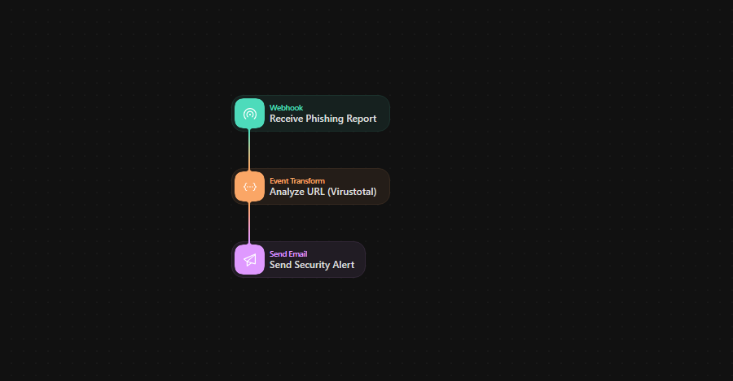
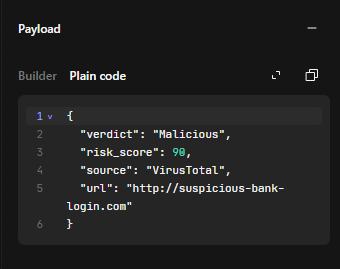
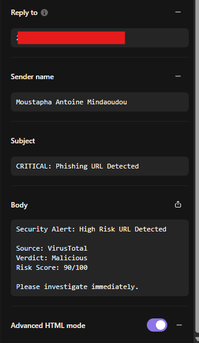
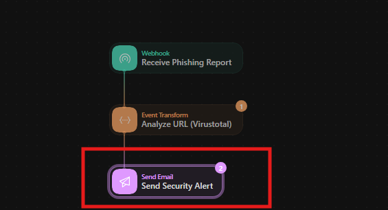
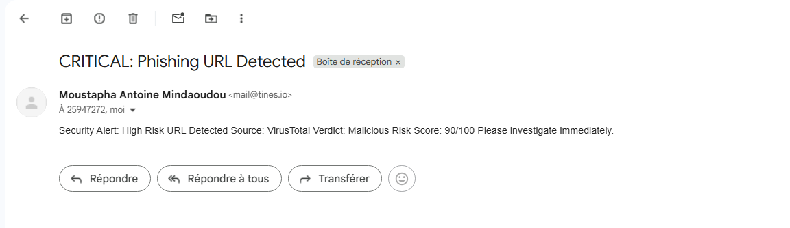

---
###  Project Overview

Phishing investigations are often repetitive and time-consuming. In this project, I utilized **Tines**, a Security Orchestration, Automation, and Response (SOAR) platform, to build an automated workflow. The goal was to eliminate manual reputation checks by automatically analysing suspicious URLs against threat intelligence feeds.

---
### Technical Implementation

#### 1. Workflow Architecture
I designed a linear automation story that ingests data, analyses it, and alerts the security team. The logic flow ensures that every reported URL is standardized and checked without human intervention.



---
#### 2. Ingestion & Trigger

The pipeline is initiated via a **Webhook** trigger. In a production environment, this would receive JSON payloads from an email gateway (e.g., Microsoft 365) or a user reporting button.

* **Input:** Raw JSON containing the suspicious URL.
* **Action:** The event is parsed to extract the domain/IP address.

---
#### 3. Threat Intelligence Enrichment

The core analysis is performed by an API integration with **VirusTotal**.

* **Mechanism:** The workflow sends a **GET** request to the VirusTotal API.
* **Logic:** The system retrieves the "Malicious" vote count.

    * *If Malicious votes > 0:* The incident is flagged as High Priority.
    * *If Malicious votes = 0:* The incident is auto-closed or flagged as Safe.

**Data Payload Configuration:**
I configured a standardized JSON structure to mock the API response for testing, ensuring consistent variables (Verdict, Risk Score) are passed to the alerting stage.

```yaml
{
  "verdict": "Malicious",
  "risk_score": 90,
  "source": "VirusTotal",
  "url": "http://suspicious-bank-login.com"
}
```



---
#### 4. Automated Alerting
Upon detecting a threat, the workflow automatically triggers a notification action. I configured an **Email Agent** to send a formatted alert to the SOC team containing the Verdict and the VirusTotal Report Link. Here are the details such as subject body sender name: 

**Email Template Configuration:** The email body is configured with dynamic fields to insert the specific URL and Risk Score found during analysis.


**Testing the Alert Mechanism:** When the "Send Security Alert" agent is triggered manually or via webhook, the system processes the payload instantly



**Result:** The system successfully dispatches a high-priority notification to the analyst's inbox within seconds of the trigger.

---
### Key Outcomes

- **Efficiency:** Reduced the Mean Time to Respond (MTTR) for URL analysis from ~5 minutes (manual) to **<5 seconds** (automated).
- **Integration:** Successfully demonstrated API connectivity between an orchestration platform and external Threat Intelligence providers.
- **Consistency:** Eliminated human error in the lookup process by standardizing the analysis procedure.

---