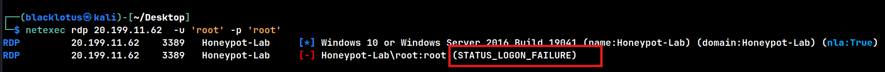

---
## Project Overview

In this project, I deployed a purposely vulnerable "Honeypot" in Microsoft Azure to monitor unauthorized access attempts. The goal was to observe real-world attack patterns, analyze the speed of automated botnets, and practice log analysis using Windows Event Viewer.

---

### Technical Implementation

#### 1. Infrastructure Deployment

I provisioned a **Windows 10 Virtual Machine** in Azure. To ensure the instance acted as an effective honeypot, I configured the internal security settings to be non-compliant with standard hardening practices:

* **Host:** Azure Standard B-Series VM.
* **OS:** Windows 10 Pro.
* **Internal Firewall:** Completely disabled (Domain, Private, and Public profiles set to OFF) to ensure ICMP and RDP reachability.


---

#### 2. Network Security Configuration (The "Bait")

I modified the Azure **Network Security Group (NSG)** to expose the machine to the public internet. I created a custom inbound rule (ALL_INBOUND_TRAFFIC`) allowing traffic from **Any Source** on **Any Port**, effectively removing the cloud-layer firewall.


connected on the machine with RDP by Downloading the RDP file and putting the password


then opened firewall rules:

```
wf.msc
```

and put the domain / private / public to off


---
#### 3. Attack Simulation

To validate the monitoring pipeline before live internet traffic arrived, I executed a controlled brute-force attack against the honeypot using **Kali Linux**. I utilized `netexec` to simulate a credential stuffing attack against the RDP service (Port 3389).

``` bash
netexec rdp 20.199.11.62  -u 'root' -p 'root'
```



 The attack successfully triggered a `STATUS_LOGON_FAILURE` response, confirming that the authentication request bypassed the network firewalls and reached the internal OS.

---

#### 4.  Log Analysis & Detection 

Inside the VM, I utilized **Windows Event Viewer** to capture the telemetry. The brute-force attempts generated **Event ID 4625 (An account failed to log on)**.

**Evidence of Compromise Attempts:** The logs captured the attacker's IP address, the targeted username (`root`), and the timestamp of the attack, proving the visibility of the logging pipeline.


---

### Key Limitations

While this project successfully demonstrated the mechanics of a honeypot, a production-grade deployment would require:

1. **Log Forwarding:** In a real enterprise environment, these logs (Event 4625) should be forwarded to a centralized SIEM (like Azure Sentinel or Splunk) rather than staying on the local disk.

2. **Isolation:** This VM was placed in a default subnet. A true honeypot should be strictly isolated in a DMZ or a separate Virtual Network (VNet) to prevent "lateral movement" if an attacker successfully compromises the machine.

3. **Emulation:** This was a "High Interaction" honeypot (a real OS). Production honeypots often use emulation software (like T-Pot or Cowrie) to simulate services without the risk of running a full operating system.

---

### Key Outcomes

* **Cloud Infrastructure Management:** Successfully deployed and configured a custom Azure Virtual Machine and manipulated Network Security Groups (NSGs) to create a controlled vulnerability environment.
* **Red Team Simulation:** Gained hands-on experience with offensive security tools (**Kali Linux**, **NetExec**) to simulate real-world brute-force attacks and validate network reachability.
* **Blue Team Log Analysis:** developed proficiency in Windows Event Forensics, specifically identifying **Event ID 4625** to correlate network traffic with authentication failures.
* **Attack Chain Visualization:** Validated the complete attack lifecycle, monitoring how external threats traverse cloud firewalls to impact internal operating system logs.


