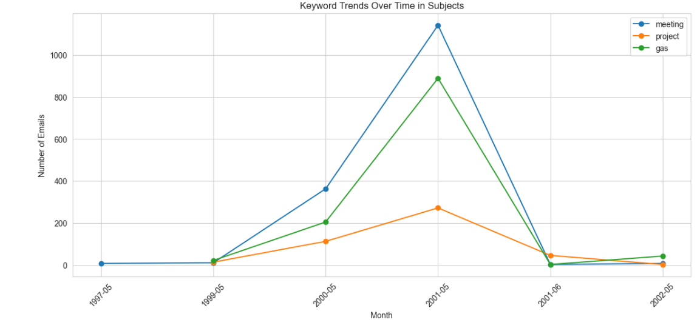

### Project Overview

This project provides a detailed exploratory analysis of the Enron email dataset (~517,000 emails), aiming to uncover patterns in internal communication, key actors, and topical trends during the company's operational period. The analysis demonstrates core digital forensics skills including data ingestion, regex-based parsing, sanitation, and temporal visualization.

---

## 1. Environment Setup

**Data Source:** [Kaggle - Enron Email Dataset](https://www.kaggle.com/datasets/wcukierski/enron-email-dataset?resource=download) 
**Required Libraries:** To replicate this analysis, install the necessary Python packages:

```python
pip install notebook pandas openpyxl
````

**Importing Libraries:** Setting up the environment for data processing and visualization:
```python
import pandas as pd
import matplotlib.pyplot as plt
import seaborn as sns
import networkx as nx

%matplotlib inline
sns.set_style("whitegrid")
```

---
## 2. Data Loading & Verification

The raw dataset (**emails.csv**) is ingested using Pandas. Error handling is implemented to ensure file path integrity.

```python
try:
    df = pd.read_csv("emails.csv")
    print("Success! Data loaded.")
    display(df.head())
except FileNotFoundError:
    print("Error: Could not find emails.csv. Please check the file name and location.")
```

![[Enron Dataset Analysis/Images/image1.png]]
### Initial Observations

* **Volume:** 517,401 total emails.
* **Structure:** Contains 4 raw columns: **file**, **message**, **from**, **subject**.
* **Scope:** 20,328 unique senders and 158,949 unique subjects, indicating a massive web of internal communication.

---
## 3. Data Cleaning & Feature Extraction

Raw email headers require parsing to separate metadata from content. Regular Expressions (Regex) were used to extract clean fields for analysis.

### Extraction Strategy

* **Senders:** Extracted from the `From:` header.
* **Timestamps:** Extracted `Date:` headers, cleaned timezone artifacts, and converted to UTC datetime objects.
* **Subjects:** Isolated `Subject:` lines for content analysis.

```python
import re

# Sender extraction
df['from'] = (
    df['message']
    .str.extract(r'^From:\s*(.+)$', flags=re.MULTILINE)[0]
    .str.strip()
    .str.lower()
)

# Raw date extraction
df['date_raw'] = (
    df['message']
    .str.extract(r'^Date:\s*(.+)$', flags=re.MULTILINE)[0]
)

# Clean timezone info
df['date_clean'] = df['date_raw'].str.replace(r'\s*\(.*\)$', '', regex=True)

# Convert to datetime (UTC)
df['date'] = pd.to_datetime(df['date_clean'], errors='coerce', utc=True)

# Subject extraction
df['subject'] = (
    df['message']
    .str.extract(r'^Subject:\s*(.+)$', flags=re.MULTILINE)[0]
    .str.strip()
)
```

### Verification of Cleaned Data

```python
df[['date_raw','date','from','subject']].head()
```


---
## 4. Traffic Analysis: Top Senders

Identifying key communicators is critical in forensic investigations to establish a "Person of Interest" list.

```python
top5_senders = df['from'].value_counts().head(5).index

plt.figure(figsize=(14,6))
for sender in top5_senders:
    sender_emails = df_time[df_time['from']==sender].groupby(df_time['date'].dt.to_period('M')).size()
    plt.plot(sender_emails.index.astype(str), sender_emails.values, marker='o', label=sender)

plt.title("Top 5 Enron Senders Over Time")
plt.xlabel("Month")
plt.ylabel("Number of Emails Sent")
plt.xticks(rotation=45)
plt.legend()
plt.grid(True)
plt.show()
```


### Forensic Insight

- **Key Actor:** kay.mann@enron.com is consistently the highest volume sender. Kay Mann was the head of legal for Enron, explaining the high volume of documentation and correspondence.
* **Pattern:** The top 10 senders account for a disproportionate amount of traffic, a common pattern in corporate hierarchies (Pareto Principle).

---
## 5. Content Analysis: Common Subjects

To understand the organizational focus, the frequency of non-stop words within email subjects was analysed.

```python
from collections import Counter

stopwords = set(['re','fw','fwd','of','and','to','on','in','the','for','a','an','is','this','that','with','by','from','as','at','be','it','new'])

subjects = df['subject'].dropna().str.lower().tolist()
words = [w for s in subjects for w in re.findall(r'\b[a-z]{2,}\b', s) if w not in stopwords]
counter = Counter(words)

common_words = counter.most_common(20)
print(common_words)

# Visualization
words_, counts_ = zip(*common_words)
plt.figure(figsize=(10,6))
sns.barplot(x=list(counts_), y=list(words_), palette='viridis')
plt.title("Top 20 Most Common Words in Email Subjects")
plt.xlabel("Frequency")
plt.ylabel("Word")
plt.show()
```


### Observations

* **Business Focus:** Words like "agreement", "meeting", "project", and "gas" dominate.
* **Urgency:** The high frequency of "meeting" suggests a culture of heavy collaboration or bureaucracy.

---
## 6. Temporal Analysis: Keyword Trends

Tracking specific keywords over time can reveal when specific projects or crises occurred.

```python
keywords = ['meeting','project','gas']
plt.figure(figsize=(14,6))

for kw in keywords:
    kw_emails = df[df['subject'].str.contains(kw, na=False, case=False)]
    kw_monthly = kw_emails.groupby(kw_emails['date'].dt.to_period('M')).size()
    plt.plot(kw_monthly.index.astype(str), kw_monthly.values, marker='o', label=kw)

plt.title("Keyword Trends Over Time in Subjects")
plt.xlabel("Month")
plt.ylabel("Number of Emails")
plt.xticks(rotation=45)
plt.legend()
plt.grid(True)
plt.show()
```



### **Observations:**

- **Activity Spike (2000–2001):** The dramatic increase in "meeting" and "gas" keywords between May 2000 and May 2001 correlates with the period of highest operational pressure and stock volatility prior to the company's collapse.
- **Urgency Indicators:** The keyword "meeting" (blue line) tracks closely with "gas" (green line), suggesting that operational discussions about energy commodities were driving the need for increased internal coordination.
- **Sudden Drop-off:** The sharp decline post-May 2001 warrants further investigation to determine if this represents a change in logging practices, a shift in communication channels, or a loss of data integrity.

---
## 7. Summary of Findings

* **Data Integrity:** Successfully ingested and cleaned ~517k emails, standardizing timestamps for timeline analysis.
* **Actor Identification:** Identified `kay.mann@enron.com` as a primary node of communication.
* **Contextual Awareness:** Subject line analysis confirmed "gas" and "legal agreements" as the primary business drivers.
* **Timeline Reconstruction:** Established a timeline of communication volume that can be mapped against external events (e.g., stock prices or public announcements).

---
### Key Outcomes

* **eDiscovery Readiness:** Demonstrated the ability to process unstructured text data (email headers/bodies) into structured formats suitable for legal review.
* **Pattern Recognition:** Applied statistical analysis to identify anomalies in communication volume and subject matter.
* **Python for Forensics:** Utilized Pandas and Regex to automate the parsing of large-scale datasets, a critical skill for handling modern digital evidence.

