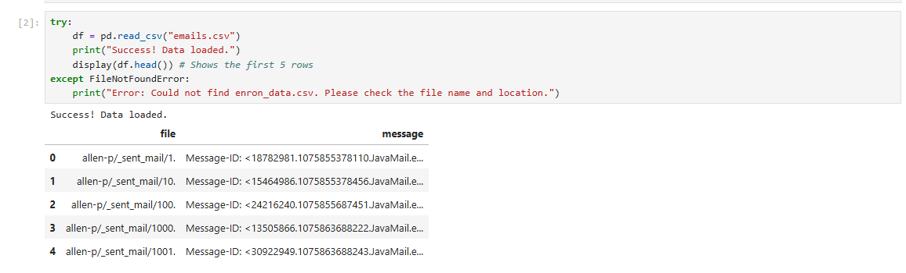
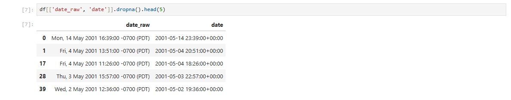
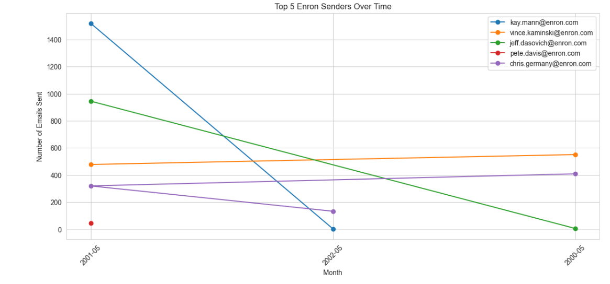
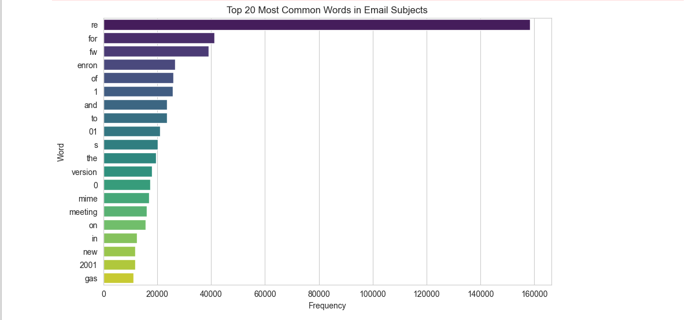

### Project Overview
This project provides a detailed exploratory analysis of the Enron email dataset, highlighting key senders, communication patterns, and topical trends over time. The analysis demonstrates data cleaning, text processing, visualization, and basic network analysis skills.

---

#### 1. Installation and Setup

Download the Enron dataset here: [Kaggle - Enron Email Dataset](https://www.kaggle.com/datasets/wcukierski/enron-email-dataset?resource=download)

**Install required Python packages:**

```python
pip install notebook pandas openpyxl
python -m pip install matplotlib seaborn
python -m pip install networkx
```

**Launch Jupyter Notebook:**

```
python -m notebook
```

**Import libraries in a new notebook:**

```python
import pandas as pd
import matplotlib.pyplot as plt
import seaborn as sns
import networkx as nx

%matplotlib inline
sns.set_style("whitegrid")
```

---
#### 2. Load Dataset

To begin with I had  to load the dataset (**emails.csv**)

```python
try:
    df = pd.read_csv("emails.csv")
    print("Success! Data loaded.")
    display(df.head())
except FileNotFoundError:
    print("Error: Could not find emails.csv. Please check the file name and location.")
```

**Observations:**

- 517,401 emails with 4 columns: **file**, **message**, **from**, **subject**
- **20,328 unique senders** and **158,949 unique subjects**



---
#### 3. Data Cleaning and Extraction

I then extracted key fields from raw headers:

```python
import re

# Sender extraction
df['from'] = (
    df['message']
    .str.extract(r'^From:\s*(.+)$', flags=re.MULTILINE)[0]
    .str.strip()
    .str.lower()
)

# Raw date extraction
df['date_raw'] = (
    df['message']
    .str.extract(r'^Date:\s*(.+)$', flags=re.MULTILINE)[0]
)

# Clean timezone info
df['date_clean'] = df['date_raw'].str.replace(r'\s*\(.*\)$', '', regex=True)

# Convert to datetime (UTC)
df['date'] = pd.to_datetime(df['date_clean'], errors='coerce', utc=True)

# Subject extraction
df['subject'] = (
    df['message']
    .str.extract(r'^Subject:\s*(.+)$', flags=re.MULTILINE)[0]
    .str.strip()
)
```

**And then verified the extraction:** 

```python
df[['date_raw','date','from','subject']].head()
```



---
#### 4. Top 5 senders over time

```python
top5_senders = df['from'].value_counts().head(5).index

plt.figure(figsize=(14,6))
for sender in top5_senders:
    sender_emails = df_time[df_time['from']==sender].groupby(df_time['date'].dt.to_period('M')).size()
    plt.plot(sender_emails.index.astype(str), sender_emails.values, marker='o', label=sender)

plt.title("Top 5 Enron Senders Over Time")
plt.xlabel("Month")
plt.ylabel("Number of Emails Sent")
plt.xticks(rotation=45)
plt.legend()
plt.grid(True)
plt.show()
```



**Observations:**

- kay.mann@enron.com is the most frequent sender
- Top 10 senders dominate a significant portion of email activity

---
#### 5. Most Common Words in Subjects

```python
from collections import Counter

stopwords = set(['re','fw','fwd','of','and','to','on','in','the','for','a','an','is','this','that','with','by','from','as','at','be','it','new'])

subjects = df['subject'].dropna().str.lower().tolist()
words = [w for s in subjects for w in re.findall(r'\b[a-z]{2,}\b', s) if w not in stopwords]
counter = Counter(words)

common_words = counter.most_common(20)
print(common_words)

# Visualization
words_, counts_ = zip(*common_words)
plt.figure(figsize=(10,6))
sns.barplot(x=list(counts_), y=list(words_), palette='viridis')
plt.title("Top 20 Most Common Words in Email Subjects")
plt.xlabel("Frequency")
plt.ylabel("Word")
plt.show()
```



**Observations:**

- Words like **meeting**, **project**, **gas** dominate
- Indicative of organizational focus and recurring topics

---
#### 6. Keyword Trends Over Time

```python
keywords = ['meeting','project','gas']
plt.figure(figsize=(14,6))

for kw in keywords:
    kw_emails = df[df['subject'].str.contains(kw, na=False, case=False)]
    kw_monthly = kw_emails.groupby(kw_emails['date'].dt.to_period('M')).size()
    plt.plot(kw_monthly.index.astype(str), kw_monthly.values, marker='o', label=kw)

plt.title("Keyword Trends Over Time in Subjects")
plt.xlabel("Month")
plt.ylabel("Number of Emails")
plt.xticks(rotation=45)
plt.legend()
plt.grid(True)
plt.show()
```


**Observations:**

- Peaks correspond to company projects and critical events
---
#### 7. Summary of Findings

1. **Dataset Overview:** Clean dataset, 517k emails, wide range of senders and subjects.
2. **Top Senders:** `kay.mann@enron.com` dominates; top 10 senders handle a large volume.
3. **Subject Analysis:** Frequent keywords reveal company focus (meetings, projects, gas).
4. **Temporal Trends:** Keyword trends show peaks in organizational activity.

---
### Key Outcomes


