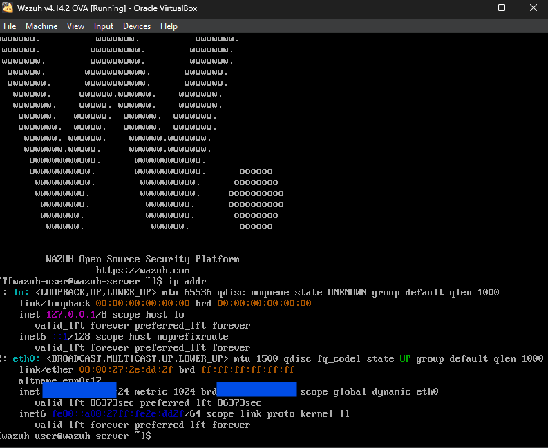
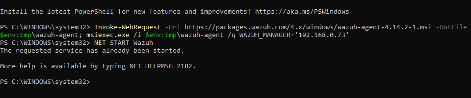
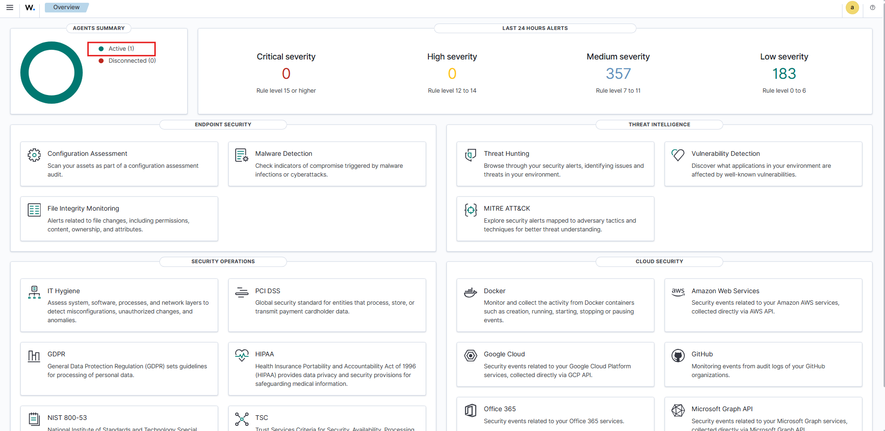
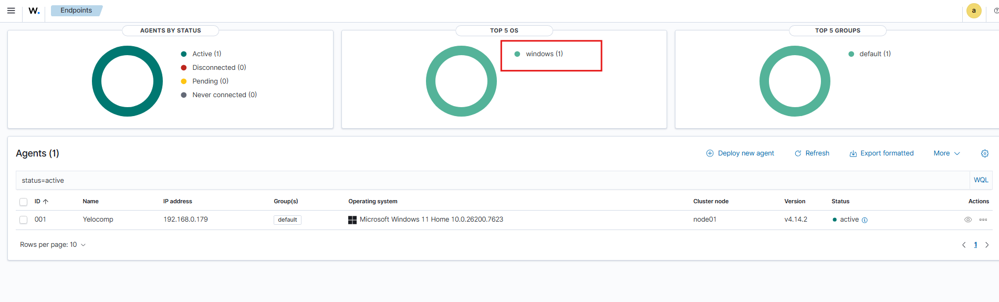
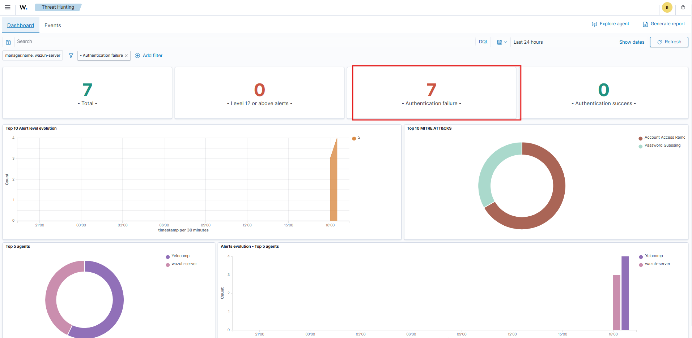
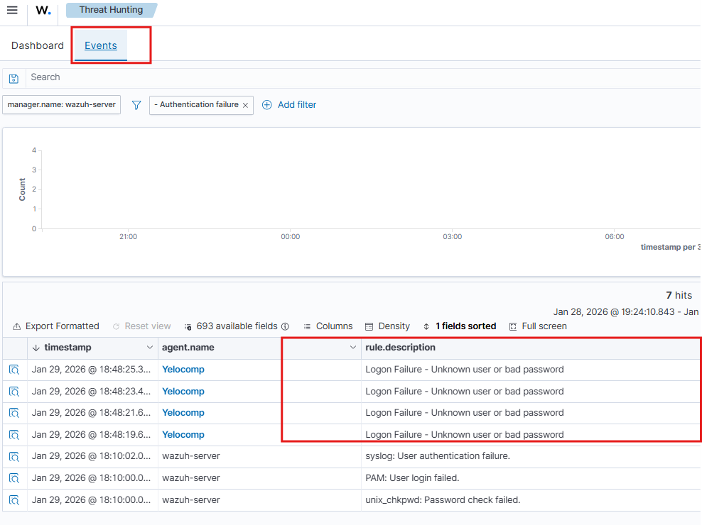

---
### Project Overview

In this project, I deployed the Wazuh Security Information and Event Management (SIEM) platform to create a centralized threat detection system. The objective was to gain visibility into endpoint activities and validate the system's ability to detect common attack vectors in real-time.

---

### Technical Implementation

#### **1. Infrastructure Setup**

I hosted the Wazuh Manager on a Linux-based virtual machine (VirtualBox) to act as the central log aggregator. The server  started and I went on the Wazuh Instance on my host machine browser.



---

#### **2. Agent Configuration**

I deployed the Wazuh Agent on a Windows 11 endpoint to capture system events. The following PowerShell commands were executed to download the agent and forward telemetry to the manager.

```powershell
Invoke-WebRequest -Uri https://packages.wazuh.com/4.x/windows/wazuh-agent-4.14.2-1.msi -OutFile $env:tmp\wazuh-agent; msiexec.exe /i $env:tmp\wazuh-agent /q WAZUH_MANAGER='<IP ADDRESS>
```

``` powershell
NET START Wazuh
```




---

#### **3. Verification**

The installation was successful, and the service started immediately without errors.




---

#### **4. Attack Simulation**

To test detection, I executed a manual **brute-force attack** (multiple failed login attempts). And then proceeded to go back on the Wazuh to verify the effectiveness

After I went back on the main dashboard which provides a high-level view of the environment. The metrics highlight the spike in "Authentication failures" corresponding to the simulated attack window.



---

#### **5. Event Analysis**

A deep dive into the specific security alerts. This view confirms the simulated events were correctly parsed and flagged as security incidents.


---

### Key Outcomes

* Successfully established a functional SOC pipeline, confirming active agent status and log ingestion.
* Detected the brute-force attempt immediately, triggering a high-severity alert.
* Visualized the attack timeline and frequency using the Wazuh dashboard to identify the specific threat vector.

---


